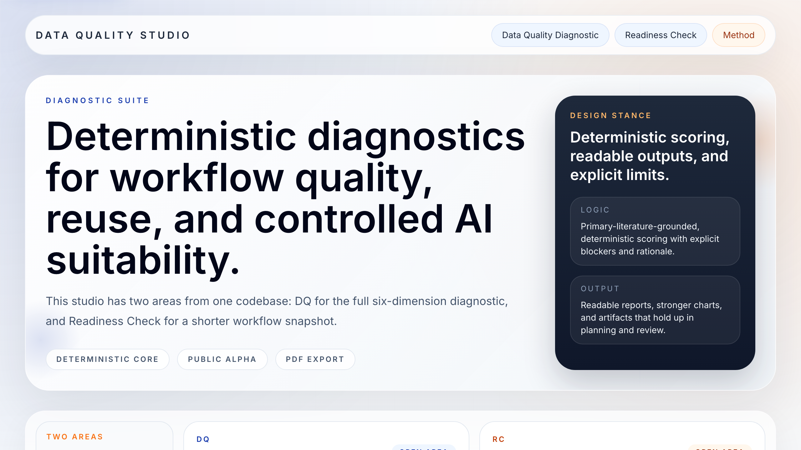
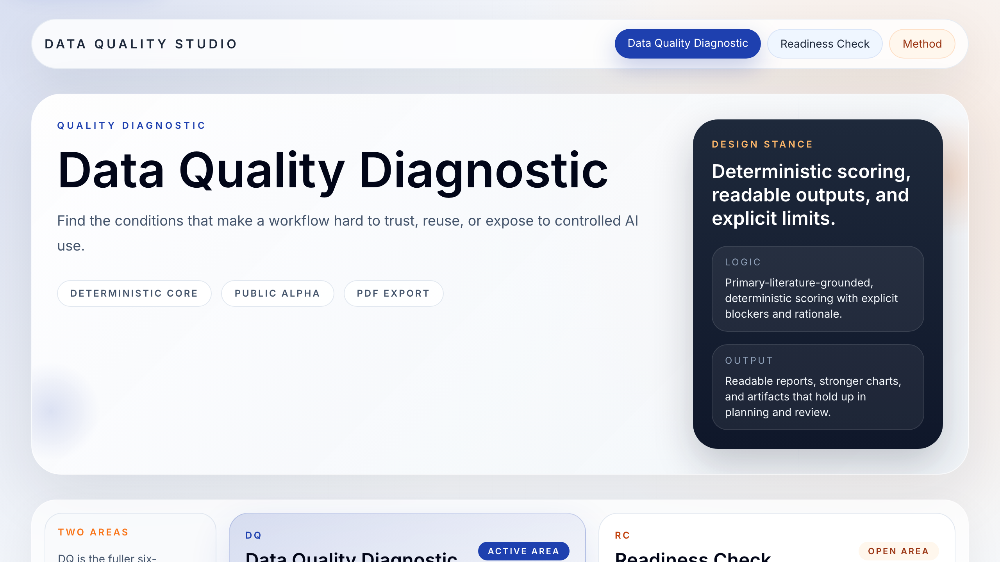
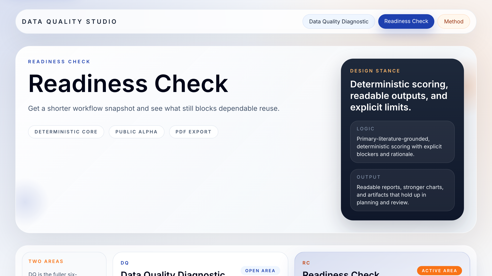

# Data Quality Studio

[](https://data-quality-explorer-studio.vercel.app/)
[](https://vercel.com/)
[](https://nextjs.org/)
[](https://www.convex.dev/)
[](https://console.groq.com/docs/overview)
[](./LICENSE)
[](https://data-quality-explorer-studio.vercel.app/method)

Deterministic workflow diagnostics for trust, reuse, operating state, and controlled AI suitability.

## Live product

- Public URL: [data-quality-explorer-studio.vercel.app](https://data-quality-explorer-studio.vercel.app/)
- Hosting: [Vercel](https://vercel.com/), project `data-quality-explorer-studio`
- Repository: [AI-Enablement-Academy/data-quality-studio](https://github.com/AI-Enablement-Academy/data-quality-studio)

## Screenshots

### Home



### Data Quality Diagnostic



### Readiness Check



## Product split

This repository ships two public surfaces from one codebase:

- `Data Quality Diagnostic`
  - the fuller six-dimension diagnostic
  - built to show where a workflow breaks before anyone labels maturity
  - produces blocker ranking, operating state, capability gaps, AI suitability, and action plan
- `Readiness Check`
  - the shorter sponsor-facing readout
  - uses the same deterministic engine
  - compresses the output into operating state, capability gaps, and next moves

## What this repo is trying to do

Most data tooling either collapses into a vague self-assessment or jumps straight to AI advice without proving the data foundation first. This project takes the opposite stance:

- diagnose workflow conditions before making reuse claims
- keep the scoring deterministic and inspectable
- let AI interpret a finished report, never decide the score
- produce outputs that can survive real sponsor and operating conversations

## Provenance boundary

This alpha is intentionally grounded in primary literature and implemented as an original product model.

The method draws on:

- Wang & Strong (1996)
- Pipino, Lee & Wang (2002)
- Wang (1998)
- Lawrence (2017)

The following are original to this implementation:

- the six diagnostic dimensions
- the operating-state model
- the AI suitability gate
- the question bank
- the deterministic scoring engine
- the action-plan composition

The academic references inform the conceptual background. The dimensions, prompts, operating states, and scoring logic here are product decisions made in this codebase.

### References

- Wang, Richard Y. (1998). [A Product Perspective on Total Data Quality Management](https://web.mit.edu/tdqm/www/tdqmpub/WangCACMFeb98.pdf). *Communications of the ACM*, 41(2), 58-65.
- Wang, Richard Y., and Diane M. Strong (1996). [Beyond Accuracy: What Data Quality Means to Data Consumers](https://www.tandfonline.com/doi/abs/10.1080/07421222.1996.11518099). *Journal of Management Information Systems*, 12(4).
- Pipino, Leo L., Yang W. Lee, and Richard Y. Wang (2002). *Data Quality Assessment*. *Communications of the ACM*, 45(4), 211-218.
- Lawrence, Neil D. (2017). [Data Readiness Levels](https://arxiv.org/abs/1705.02245). *arXiv:1705.02245*.

## Core principles

- Deterministic first. The scoring engine is pure TypeScript.
- Explainable by design. Every serious result should be challengeable.
- Private by default. Local browser storage is the alpha default.
- Optional AI assist only. The chat layer interprets reports and can fall back to deterministic mode.
- Useful artifacts over dashboard filler. Reports, blockers, action plans, PDF exports, JSON exports.

## Features

- Two public surfaces from one shared Next.js app
- Six-dimension diagnostic profile
- Deterministic questionnaire and scoring engine
- Operating-state assignment with threshold notes and capability gaps
- AI suitability gate for controlled reuse decisions
- Optional CSV and note evidence inputs on DQ
- PDF export plus JSON export
- Portable snapshot-style share links
- Local report history with expiry and delete controls
- Optional Groq-backed report assistant with deterministic fallback
- Convex-backed shared throttling for `/api/chat` and `/api/report-pdf`
- Public method page with alpha boundaries, privacy notes, and source statement

## Routes

- `/`
- `/dq`
- `/dq/start`
- `/dq/results`
- `/drl`
- `/drl/start`
- `/drl/results`
- `/method`
- `/dmm` redirects to `/dq`

## Repo map

### For humans

- [src/app](./src/app)
  - route entry points and API handlers
- [src/components/diagnostics](./src/components/diagnostics)
  - UI shell, flows, results, charts, PDF document
- [src/lib/diagnostics](./src/lib/diagnostics)
  - engine, catalog, evidence parsing, storage helpers, chat guard
- [convex](./convex)
  - Convex schema and rate-limit mutation
- [task.md](./task.md)
  - current state and active follow-up areas
- [walkthrough.md](./walkthrough.md)
  - runbook and validation notes

### For agent workers

1. Read [task.md](./task.md).
2. Read [walkthrough.md](./walkthrough.md).
3. Keep the deterministic scoring boundary intact.
4. Do not let AI features alter final scores, operating state, or AI suitability.
5. Keep local `.env*` secrets out of git.
6. Update docs when behavior changes.

Critical files:

- [src/lib/diagnostics/engine.ts](./src/lib/diagnostics/engine.ts)
  - dimension scoring, operating-state assignment, result composition
- [src/lib/diagnostics/questions.ts](./src/lib/diagnostics/questions.ts)
  - typed question bank
- [src/lib/diagnostics/chat-guard.ts](./src/lib/diagnostics/chat-guard.ts)
  - request validation and shared abuse controls
- [convex/rateLimits.ts](./convex/rateLimits.ts)
  - durable shared throttle path

## Stack

- Next.js 16
- React 19
- TypeScript
- Tailwind CSS 4
- GSAP
- Lenis
- Chart.js
- Convex
- Groq

## Local development

```bash
pnpm install
pnpm dev
```

Open [http://127.0.0.1:3000](http://127.0.0.1:3000).

### Validation

```bash
pnpm test
pnpm lint
pnpm build
```

## Environment variables

Use `.env.local` for local development. Never commit real secrets.

```bash
GROQ_API_KEY=replace_me
GROQ_MODEL=qwen/qwen3-32b
CONVEX_URL=https://your-project-name.convex.cloud
CONVEX_HTTP_URL=https://your-project-name.convex.site
CONVEX_DEPLOY_KEY=prod:replace_me
```

Notes:

- `CONVEX_URL` is used by the Next.js server routes for durable shared throttling.
- `CONVEX_HTTP_URL` is reserved for future HTTP-action-oriented backend work and persistence features.
- `CONVEX_DEPLOY_KEY` is optional locally, but used for builds that should deploy Convex alongside the app.

## Hosting and deployment

This project is hosted on Vercel.

Why:

- the app has server routes for Groq and PDF export
- provider secrets must stay server-side
- Vercel handles the Next.js runtime cleanly
- custom domain and preview flow are straightforward

Current live endpoints:

- [data-quality-explorer-studio.vercel.app](https://data-quality-explorer-studio.vercel.app/)

## AI and privacy boundaries

- DQ and readiness scoring remain deterministic
- the AI chat can only interpret a finished report
- deterministic mode stays available even if Groq is unavailable or rate-limited
- report history is browser-local in this alpha
- raw CSV uploads and pasted notes are not retained in draft autosave
- share links are portable snapshot links, not signed server-issued records yet

See the live `/method` page for the product-facing method statement and alpha limitations.

## Verification status

Recent checks:

- `pnpm test`
- `pnpm lint`
- `pnpm build`
- route crawl across `/`, `/dq`, `/dq/start`, `/dq/results`, `/drl`, `/drl/start`, `/drl/results`, `/method`
- browser audit on a fresh `next start` server

## License and posture

The code in this repository is MIT-licensed.

The codebase is public on purpose. The scoring logic is inspectable. The method is challengeable. The product surface is still alpha and should be treated as decision support, not legal, regulatory, or compliance advice.

Data Quality Studio created by [Adam Kovacs](https://www.linkedin.com/in/adambkovacs/) x AI Enablement Academy.
